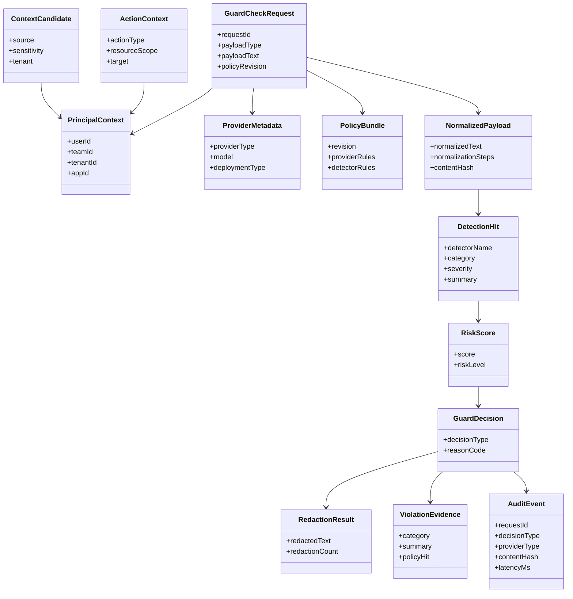
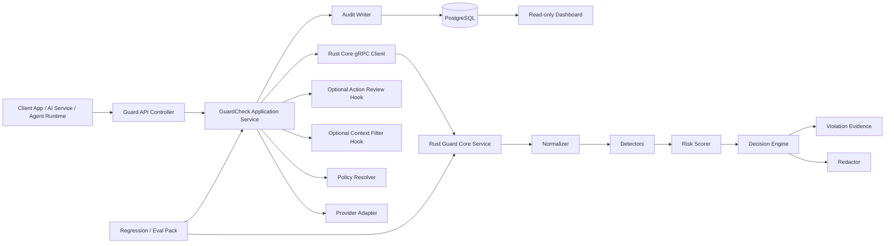
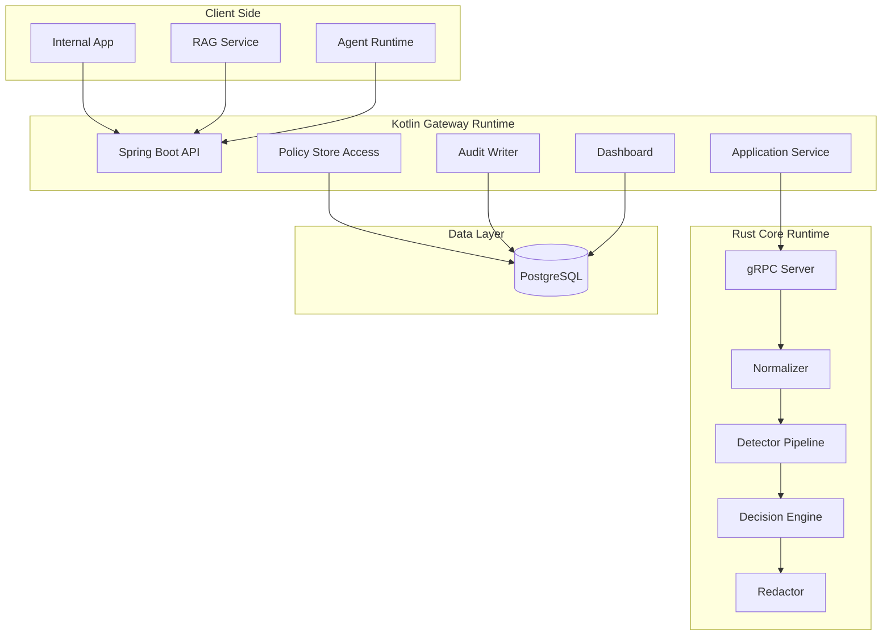
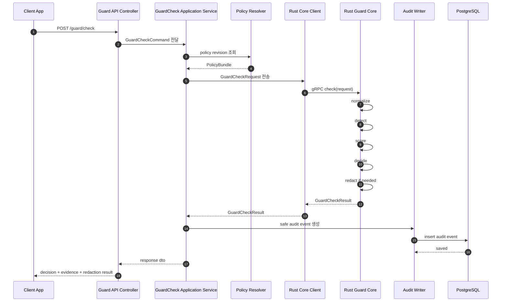
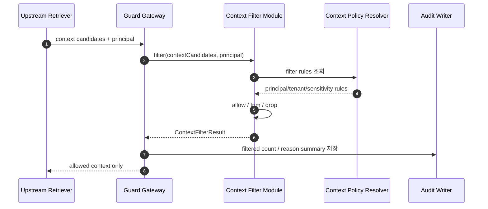
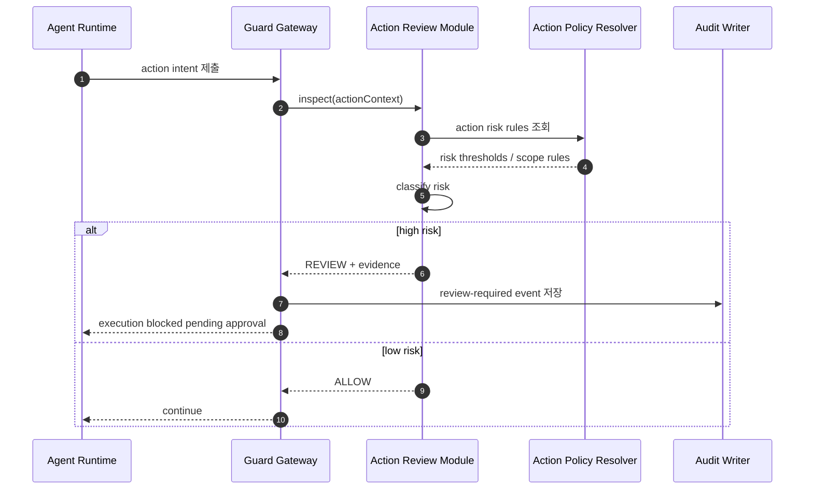

# Universal AI Boundary Guard 기능 명세 및 설계 문서

## 1. 문서 목적

이 문서는 Universal AI Boundary Guard의 **MVP 본체**, **확장 모듈**, **검증 도구**를 기준으로 기능 명세, 도메인 구조, 아키텍처, 주요 시퀀스, 테스트 전략을 정리한다.

본 문서는 다음 상위 계획을 구현 가능한 수준으로 구체화한다.

- `plans/2026-04-26-universal-ai-boundary-guard-implementation-v1.md`
- `plans/2026-04-26-guard-decision-pipeline-detailed-implementation-v1.md`

## 2. 제품 한 줄 정의

Universal AI Boundary Guard의 현재 소스코드 SSOT 구현은 text payload를 정규화하고 정책 기반 `ALLOW`, `REDACT`, `BLOCK` 결정을 반환하는 Rust Guard Core와 gRPC Guard Service다. Provider-agnostic AI Guard Gateway 전체 구조는 제품 비전으로 유지하되, provider/principal-aware policy wiring과 audit/monitoring 계층은 후속 단계로 둔다.

## 3. 범위

### 3.1 현재 SSOT 기준 MVP 본체 범위

- Rust Guard Core
- Rust gRPC Guard Service
- text payload normalize / detect / score / decide
- `ALLOW`, `REDACT`, `BLOCK` decision
- redaction result 반환
- raw 민감값 미노출 테스트

### 3.2 제품 비전상 MVP 본체 확장 범위

- 단일 AI ingress 제공
- provider abstraction
- evidence 기반 audit log 저장
- read-only dashboard 조회

### 3.2 확장 모듈 범위

#### A. Permission-aware Context Filter
- 상위 시스템이 전달한 context candidate 필터링
- principal / tenant / sensitivity / source 기준 trimming
- filtered count audit 저장

#### B. High-Risk Action Review
- action type taxonomy
- tool/service/command intent 검사
- high-risk action의 `REVIEW` decision 승격

### 3.3 검증 도구 범위

- detector fixture
- prompt injection regression
- pii/secret regression
- normalization bypass regression
- provider request matrix
- build / CI 연동

### 3.4 범위 제외

- enterprise search 구축
- knowledge graph 구축
- full sandbox runtime
- file/archive/APT guard의 본격 구현
- SIEM/SOAR, AV, sandbox 연동

## 4. 기능 명세서

## 4.1 핵심 사용자/시스템 역할

| 역할 | 설명 | 주요 책임 |
|---|---|---|
| API Client App | Guard Service를 호출하는 애플리케이션 | payload와 policy revision 전달 |
| Gateway API | 상위 비전 계층 | 요청 검증, Core 호출, decision 집행, audit 저장 |
| Guard Core | Rust 기반 판정 엔진 | normalize, detect, score, decide |
| Policy Manager | 계획 계층 | policy revision 관리, allowlist/denylist 반영 |
| Audit Reader | 계획 계층 | decision 조회, block/redact 추이 확인 |
| Context Filter Module | 선택 확장 모듈 | context candidate trimming |
| Action Review Module | 선택 확장 모듈 | 고위험 action review 승격 |
| Regression Runner | 검증 도구 | fixture 기반 회귀 실행 |

## 4.2 기능 목록

| ID | 기능명 | 설명 | 우선순위 | 계층 |
|---|---|---|---|---|
| F-01 | Guard Check API | gRPC `check`로 payload 검사 요청을 받는다 | P1 | 현재 SSOT MVP |
| F-02 | Provider Abstraction | provider type과 model metadata를 정규화하는 상위 통합 계층 | P2 | 계획 범위 |
| F-03 | Payload Normalization | Base64, URL encoding, HTML entity, Unicode normalization을 수행한다 | P1 | 현재 SSOT MVP |
| F-04 | Prompt Injection Detection | direct/indirect injection 패턴을 탐지한다 | P1 | 현재 SSOT MVP |
| F-05 | PII Detection | 개인정보 패턴을 탐지한다 | P1 | 현재 SSOT MVP |
| F-06 | Secret Detection | 키, 토큰, credential 패턴을 탐지한다 | P1 | 현재 SSOT MVP |
| F-07 | Decision Engine | `ALLOW`, `REDACT`, `BLOCK` 결정을 생성한다 | P1 | 현재 SSOT MVP |
| F-08 | Redaction Result | 마스킹된 결과와 근거를 반환한다 | P1 | 현재 SSOT MVP |
| F-09 | Audit Logging | 원문 없이 evidence 기반 감사 로그를 저장한다 | P2 | 계획 범위 |
| F-10 | Read-only Dashboard | request/block/redact/policy hit를 조회한다 | P2 | 계획 범위 |
| F-11 | Context Filtering | context candidate를 permission-aware rule로 필터링한다 | P2 | 확장 모듈 |
| F-12 | High-Risk Action Review | tool/service/command를 `REVIEW` 대상으로 승격한다 | P2 | 확장 모듈 |
| F-13 | Regression Pack | detector와 normalization 우회 회귀를 자동 검증한다 | P2 | 검증 도구 |

## 4.3 MVP 기능 상세 명세

### F-01. Guard Check API

**목적**
- Client App이 payload 검사를 단일 guard service API로 요청할 수 있게 한다.

**현재 SSOT 입력**
- request id
- payload text
- payload type
- policy revision

**proto contract 상 존재하지만 현재 decision 미사용**
- provider metadata
- principal metadata

**현재 SSOT 출력**
- decision type
- violation evidence 목록
- redaction result
- risk score
- policy revision
- core latency

**후속 추가 예정**
- normalized payload hash
- HTTP `/guard/check` gateway layer

**성공 기준**
- text payload 요청이 Rust Core까지 전달된다.
- 처리 결과가 gRPC 응답에 반영된다.

### F-02. Provider Abstraction

**목적**
- provider 차이를 상위 Gateway adapter 계층에서 흡수한다.

**상태**
- 현재 SSOT 기준 Rust Guard Core는 provider-unaware payload guard다.
- provider type/model/deployment metadata 정규화는 proto/Gateway 통합 단계에서 후속 반영한다.

**목표 지원 provider**
- `ANTHROPIC`
- `OPENAI_COMPATIBLE`
- `GOOGLE`
- `INTERNAL`

**규칙**
- policy engine은 provider별 raw schema를 직접 알지 않는다.
- 모든 provider 요청은 공통 metadata 구조로 변환되는 것을 목표로 한다.

### F-03. Payload Normalization

**목적**
- 인코딩/표현 우회로 detector를 회피하는 것을 줄인다.

**처리 항목**
- Base64 decode 시도
- URL decode
- HTML entity decode
- Unicode normalization

**규칙**
- 원문과 정규화 결과를 혼동하지 않는다.
- audit에는 원문이 아니라 hash와 summary만 남긴다.

### F-04 ~ F-06. Detection Layer

**공통 목적**
- 정책 결정에 필요한 위반 근거를 생성한다.

**출력 공통 구조**
- detector name
- category
- severity
- message summary
- source offsets
- normalized source

**현재 한계**
- confidence는 아직 없음
- 별도 `redaction_candidate` 모델 대신 finding offset 기반 redaction을 사용한다

### F-07. Decision Engine

**규칙**
- 위반 없음: `ALLOW`
- 마스킹 가능 위반: `REDACT`
- 차단 필요 위반: `BLOCK`

**MVP 결정 원칙**
- provider denylist 위반 정책은 상위 Gateway 통합 시 반영한다.
- 현재 SSOT 구현은 `Critical` finding 또는 충분히 높은 risk score에서 `BLOCK`한다.
- redact 가능한 finding이 있으면 `REDACT`한다.
- secret 탐지는 현재 구현상 기본 `REDACT` 경향이며, severity/score 임계치에 따라 `BLOCK`으로 승격된다.
- injection 위험은 severity와 score 기반으로 판정한다.

### F-08. Redaction Result

**포함 항목**
- redacted text 또는 redacted fragment summary
- redaction count
- redaction labels

**규칙**
- redaction은 reversible secret storage가 아니다.
- 운영자는 원문을 dashboard에서 볼 수 없다.

### F-09. Audit Logging

**상태**
- 현재 SSOT 범위에는 audit persistence 구현이 포함되지 않는다.
- 아래 항목은 상위 Gateway/Monitoring 계층에서 저장 대상으로 설계된 필드다.

**저장 항목**
- request id
- provider
- model
- principal
- payload type
- decision
- evidence summary
- content hash
- redacted summary
- latency
- policy revision

**저장 금지 항목**
- 원문 payload
- raw secret
- raw pii

### F-10. Read-only Dashboard

**상태**
- 현재 SSOT 범위에는 dashboard 구현이 포함되지 않는다.
- 아래 항목은 추후 monitoring/admin 계층에서 조회 대상으로 설계된 내용이다.

**조회 항목**
- request count
- block count
- redact count
- decision trend
- policy hit
- core health

**MVP 제한**
- 수정 기능 없음
- 탐지 근거 summary만 노출

## 4.4 확장 모듈 기능 명세

### F-11. Permission-aware Context Filter

**목적**
- retrieval 결과가 prompt에 들어가기 전에 권한 기준으로 trimming한다.

**입력**
- context candidate 목록
- principal
- tenant
- sensitivity
- source metadata

**출력**
- allowed context list
- filtered context count
- filtered reason summary

**규칙**
- retrieval 시스템 자체는 구현하지 않는다.
- context filter는 prompt 구성 직전에 수행한다.

### F-12. High-Risk Action Review

**목적**
- tool/service/command intent를 즉시 실행하지 않고 review 대상으로 분기한다.

**입력**
- action context
- action type
- resource scope
- tenant/user scope

**출력**
- `ALLOW` 또는 `REVIEW` 중심 결과
- high-risk reason
- action evidence

**규칙**
- 모델의 추천은 실행 허가와 동일하지 않다.
- destructive command, wide-scope DB query, external service write는 review 후보가 된다.

## 4.5 검증 도구 명세

### F-13. Regression / Eval Pack

**목적**
- 정책/탐지/정규화 우회 회귀를 지속 검증한다.

**Fixture 분류**
- prompt injection
- pii
- secret
- normalization bypass
- provider matrix

**출력**
- pass/fail
- detector coverage summary
- policy violation regression summary

## 5. 도메인 모델

## 5.1 주요 도메인 객체

| 도메인 객체 | 설명 | 책임 |
|---|---|---|
| GuardCheckRequest | Gateway에서 Core로 전달되는 검사 요청 | payload, provider, principal, policy revision 포함 |
| PrincipalContext | 요청 주체 정보 | user, team, tenant, app 식별 |
| ProviderMetadata | provider/model/deployment 정보 | provider abstraction 입력 |
| NormalizedPayload | 정규화 결과 | detector 입력 원천 |
| DetectionHit | detector 탐지 결과 | evidence와 severity 제공 |
| RiskScore | 탐지 종합 점수 | decision 평가 입력 |
| GuardDecision | 최종 결정 | `ALLOW` / `REDACT` / `BLOCK` |
| RedactionResult | 마스킹 결과 | 안전한 반환 payload 구성 |
| ViolationEvidence | 정책 위반 근거 | audit / dashboard summary 제공 |
| AuditEvent | 감사 로그 단위 | 추적과 운영 관측 |
| PolicyBundle | 정책 집합 | allowlist/denylist, thresholds 포함 |
| ContextCandidate | 확장 모듈 입력 | context filtering 대상 |
| ActionContext | 확장 모듈 입력 | tool/action review 대상 |

## 5.2 도메인 다이어그램

## 5.3 도메인 경계

### Gateway Domain
- API contract 수신
- provider adapter 적용
- audit 저장
- dashboard 조회 제공

### Guard Core Domain
- normalization
- detection
- scoring
- decision 생성
- redaction 생성

### Policy Domain
- revision 관리
- rule validation
- provider allowlist / denylist 관리

### Extension Domain
- context filtering
- action review

### Verification Domain
- fixture 관리
- regression 실행
- CI 결과 판정

## 6. 아키텍처 설계

## 6.1 아키텍처 원칙

- Controller는 요청/응답 변환만 담당한다.
- Gateway는 orchestration과 persistence를 담당한다.
- Guard Core는 순수 판정 엔진으로 분리한다.
- Policy 저장과 evaluation 책임을 분리한다.
- 확장 모듈은 본체 contract를 깨지 않고 부착 가능해야 한다.
- audit에는 원문 민감정보를 남기지 않는다.

## 6.2 논리 아키텍처 다이어그램

## 6.3 배포 아키텍처 다이어그램

## 6.4 컴포넌트 책임 분리

| 컴포넌트 | 책임 | 비책임 |
|---|---|---|
| Guard API Controller | HTTP 요청/응답 변환 | 정책 판정, detector orchestration |
| GuardCheck Application Service | use case orchestration | detector 구현 |
| Provider Adapter | provider metadata 정규화 | 최종 decision 생성 |
| Rust Core Client | gRPC 통신 | audit 저장 |
| Rust Guard Core | normalize/detect/decide/redact | DB 접근, dashboard |
| Policy Resolver | revision별 정책 조회 | detector 실행 |
| Audit Writer | safe audit event 저장 | 원문 보관 |
| Dashboard | read-only 운영 조회 | 정책 수정 |

## 7. 시퀀스 다이어그램

## 7.1 메인 시퀀스: `/guard/check`

## 7.2 확장 시퀀스: Permission-aware Context Filter

## 7.3 확장 시퀀스: High-Risk Action Review

## 8. 테스트 전략

### 8.1 테스트 전략 원칙

이 프로젝트의 테스트 전략은 다음 원칙을 따른다.

- **단위 테스트**는 Rust Core의 순수 판정 로직과 Kotlin의 변환/조합 책임을 빠르게 검증한다.
- **통합 테스트**는 gRPC, DB, policy, adapter처럼 경계면이 실제로 맞물리는지를 검증한다.
- **E2E 테스트**는 `/guard/check` 전체 흐름과 감사 기록을 실제 운영 시나리오에 가깝게 검증한다.
- **성능 테스트**는 inline runtime guard로서 허용 가능한 latency와 memory 특성을 확인한다.
- **보안 테스트**는 prompt injection, data leakage, normalization bypass, raw data persistence 금지 조건을 공격 관점에서 검증한다.
- **회귀 테스트**는 fixture 기반으로 false negative와 false positive를 동시에 관리한다.

이 구조는 gateway/observability 관점의 LiteLLM, red teaming 관점의 PyRIT와 promptfoo, 취약점 스캐닝 관점의 garak, input/output validation 관점의 Guardrails에서 참고한 운영 방향을 반영한다. `/private/tmp/litellm-readme.md:44-62`, `/private/tmp/promptfoo-readme.md:12-18`, `/private/tmp/promptfoo-readme.md:50-56`, `/private/tmp/pyrit-readme.md:5-7`, `/private/tmp/garak-readme.md:5-7`, `/private/tmp/guardrails-readme.md:27-39`

### 8.2 테스트 피라미드

| 레벨 | 목적 | 주 대상 | 실행 시점 |
|---|---|---|---|
| 단위 테스트 | 로직 정확성 검증 | normalizer, detectors, decision engine, adapter mapper | PR마다 |
| 통합 테스트 | 컴포넌트 경계 검증 | Kotlin↔Rust gRPC, PostgreSQL, policy resolver, dashboard query | PR마다 |
| E2E 테스트 | 사용자 관점 흐름 검증 | `/guard/check`, audit persistence, dashboard read path | main merge 전 |
| 성능 테스트 | latency/throughput/memory 특성 검증 | Gateway, Rust Core, gRPC path | nightly / release 전 |
| 보안 테스트 | 공격/우회/유출 방지 검증 | injection, pii, secret, audit persistence, malformed input | PR + nightly |
| 회귀/Eval | 알려진 취약 패턴 재검증 | fixture pack, provider matrix | PR + CI |

### 8.3 단위 테스트 계획

#### Rust Core 단위 테스트

대상:
- `Normalizer`
- `PromptInjectionDetector`
- `PiiDetector`
- `SecretDetector`
- `RiskScorer`
- `DecisionEngine`
- `Redactor`

검증 항목:
- Base64, URL, HTML entity, Unicode normalization이 기대한 canonical text를 만든다.
- detector별 positive/negative sample이 정확히 분류된다.
- secret 탐지가 기본적으로 `BLOCK`으로 이어진다.
- pii 탐지가 정책에 따라 `REDACT` 또는 `BLOCK`으로 이어진다.
- 위반 없음 케이스는 `ALLOW`로 귀결된다.
- redaction 결과에 원문 민감 토큰이 남지 않는다.
- detector evidence에는 category, severity, summary가 포함된다.

구현 방식:
- table-driven fixture test
- detector별 fixture 디렉터리 분리
- property-like normalization case 추가

#### Kotlin Gateway 단위 테스트

대상:
- request/response DTO mapper
- provider adapter
- application service orchestration
- audit event mapper
- dashboard view model assembler

검증 항목:
- Controller는 DTO 변환만 수행한다.
- provider metadata가 내부 공통 구조로 올바르게 변환된다.
- Rust 결과가 API 응답 DTO로 정확히 매핑된다.
- audit event에 raw payload가 포함되지 않는다.
- dashboard summary가 decision count를 정확히 계산한다.

### 8.4 통합 테스트 계획

#### Kotlin ↔ Rust gRPC 통합 테스트

목적:
- Gateway와 Rust Core 간 contract 호환성과 timeout/error mapping을 검증한다.

시나리오:
- 정상 응답: `ALLOW`
- 정상 응답: `REDACT`
- 정상 응답: `BLOCK`
- Rust Core timeout
- Rust Core unavailable
- invalid provider metadata
- request id propagation

검증 포인트:
- gRPC error가 외부 API 에러로 그대로 노출되지 않는다.
- fail-open / fail-closed 정책이 설정대로 동작한다.
- request id가 audit까지 이어진다.

#### PostgreSQL 통합 테스트

목적:
- audit persistence와 dashboard query가 실제 DB와 함께 동작하는지 확인한다.

시나리오:
- audit event insert
- redact/block event retrieval
- latest event detail 조회
- dashboard aggregate query
- retention placeholder compatibility 확인

검증 포인트:
- Testcontainers 기반 DB에서 테스트한다.
- 원문 payload, raw secret, raw pii가 persistence에 저장되지 않는다.

### 8.5 E2E 테스트 계획

#### `/guard/check` 핵심 흐름 E2E

시나리오 세트:
- benign text → `ALLOW`
- customer pii 포함 text → `REDACT`
- API key 포함 text → `BLOCK`
- base64 encoded secret → `BLOCK`
- HTML entity encoded injection phrase → detector hit
- provider denylist 위반 → `BLOCK`

검증 항목:
- HTTP 응답 decision
- evidence summary 존재
- redaction result 존재 여부
- audit record 저장 여부
- dashboard에 summary 반영 여부

#### 운영 관점 E2E

시나리오 세트:
- Rust Core unavailable 시 fallback 동작
- 다건 요청 후 dashboard count 정합성
- block/redact trend 집계 확인
- event detail에서 raw payload 미노출

### 8.6 성능 테스트 계획

#### 목표

이 시스템은 inline runtime guard이므로, “정확성만 맞고 너무 느린 시스템”이 되면 안 된다. LiteLLM이 gateway의 latency benchmark를 강조하는 점을 참고해, 본 프로젝트도 기능 구현과 별도로 성능 기준을 명시한다. `/private/tmp/litellm-readme.md:59-62`

#### 성능 테스트 종류

##### P-01. 마이크로벤치마크
대상:
- normalization 단계
- detector별 단일 실행 시간
- redact 단계

목적:
- 어떤 detector가 병목인지 식별한다.

##### P-02. 서비스 레벨 부하 테스트
대상:
- Kotlin API + Rust Core gRPC 전체 경로

시나리오:
- 소형 payload 다건 요청
- 중형 payload 다건 요청
- redact-heavy payload 다건 요청
- block-heavy payload 다건 요청

수집 지표:
- p50 / p95 / p99 latency
- requests per second
- timeout rate
- error rate
- CPU usage
- memory RSS

##### P-03. 장시간 soak 테스트
대상:
- Gateway, Rust Core, PostgreSQL를 포함한 장시간 실행 환경

시나리오:
- 수 시간 이상 반복 요청
- benign/redact/block mix traffic

목적:
- memory growth, handle leak, connection leak, retry 폭주 여부 확인

##### P-04. 메모리 누수/자원 누수 테스트
대상:
- Rust Core process
- Kotlin Gateway process

검증 항목:
- 요청 수 증가에 비례하지 않는 비정상 RSS 증가 감지
- gRPC channel / DB connection pool 누수 감지
- thread 수 비정상 증가 감지
- GC pressure 및 heap growth 추적

운영 방식:
- nightly performance job
- release 전 baseline 비교
- threshold 초과 시 회귀로 간주

### 8.7 보안 테스트 계획

#### S-01. Prompt Injection / Jailbreak 테스트
참고 방향:
- PyRIT의 risk identification / red teaming 방향 `/private/tmp/pyrit-readme.md:5-7`
- promptfoo의 red teaming 및 CI 자동화 `/private/tmp/promptfoo-readme.md:48-56`
- garak의 prompt injection, jailbreak, data leakage probing `/private/tmp/garak-readme.md:5-7`, `/private/tmp/garak-readme.md:105-131`

시나리오:
- direct prompt injection
- indirect prompt injection 문구
- encoded injection
- policy override phrase
- quoted-printable / MIME류 인코딩 우회 패턴

검증 포인트:
- detector hit 여부
- expected decision 여부
- false negative 후보 분류

#### S-02. Data Leakage 테스트
시나리오:
- API key
- bearer token
- private key 형식
- 한국형 PII
- email / phone / account-like identifier
- mixed payload with benign text + sensitive fragment

검증 포인트:
- decision과 redaction이 정책에 맞는가
- audit에 raw sensitive fragment가 남지 않는가

#### S-03. Audit Persistence 보안 테스트
시나리오:
- `BLOCK` 요청 직후 DB row 확인
- `REDACT` 요청 직후 DB row 확인
- dashboard detail 조회

검증 포인트:
- raw prompt 미저장
- raw response 미저장
- raw secret/token/private key 미저장
- summary와 hash만 저장

#### S-04. Input Robustness 테스트
시나리오:
- 비정상 UTF-8 유사 입력
- 초대형 payload
- deeply nested encoding
- malformed provider metadata
- null/empty field variation

검증 포인트:
- panic/500 없이 안전하게 실패한다.
- validation error와 security decision이 구분된다.

#### S-05. Policy Bypass 테스트
시나리오:
- provider metadata 위조
- unsupported provider type
- policy revision mismatch
- duplicated field / conflicting metadata

검증 포인트:
- denylist/allowlist 정책 우회가 불가능하다.
- unsupported request는 명확한 거부 또는 validation failure로 종료된다.

### 8.8 테스트 데이터 전략

- 실제 고객 데이터 사용 금지
- 실제 secret 사용 금지
- synthetic pii / fake token / fake key pattern만 사용
- regression fixture는 benign / risky / adversarial로 분류
- false positive / false negative 후보는 별도 카탈로그로 관리

## 8.9 참고 레포 기반 벤치마크 포인트

| 참고 소스 | 가져올 포인트 | 우리 테스트 계획 반영 |
|---|---|---|
| LiteLLM | gateway benchmark, production latency 관점 | 성능 테스트와 latency baseline |
| PyRIT | generative AI risk identification, red teaming | 보안 회귀 테스트 카테고리 |
| promptfoo | eval/red-team/CI 자동화 | regression pack, provider matrix, CI fail 기준 |
| garak | prompt injection, leakage, jailbreak probe | 공격 패턴 fixture 세분화 |
| Guardrails | input/output guard, validator 조합 | detector 단위 테스트와 validation 계층 분리 |

## 8.10 실행 계획

### PR마다 실행
- Rust unit tests
- Kotlin unit tests
- gRPC integration tests
- fixture regression subset
- audit persistence raw-data 금지 테스트

### main merge 전 실행
- `/guard/check` E2E full suite
- PostgreSQL integration tests
- dashboard read-only tests
- provider matrix regression

### nightly / release 전 실행
- soak test
- memory leak / RSS growth check
- load / stress / p95-p99 latency test
- full security red-team fixture pack

## 8.11 테스트 완료 기준

- 단위 테스트가 detector / mapper / decision rule 핵심 경로를 커버한다.
- 통합 테스트가 Kotlin↔Rust, PostgreSQL, policy 경계를 검증한다.
- E2E 테스트가 `ALLOW`, `REDACT`, `BLOCK` 전체 흐름을 검증한다.
- 성능 테스트가 latency, throughput, memory growth 기준을 측정 가능하게 만든다.
- 보안 테스트가 injection, leakage, bypass, raw persistence 금지 조건을 검증한다.
- regression pack 결과를 CI 실패 조건으로 연결한다.

## 9. 비기능 요구사항

| 항목 | 요구사항 |
|---|---|
| 보안 | 원문 민감정보를 audit에 저장하지 않는다 |
| 확장성 | provider 추가 시 Core decision model을 깨지 않는다 |
| 성능 | MVP는 text payload inline guard에 적합한 응답 시간을 목표로 한다 |
| 추적성 | 모든 decision은 evidence와 policy revision을 남긴다 |
| 운영성 | dashboard에서 block/redact 추세와 core health를 확인한다 |
| 테스트 가능성 | regression fixture로 detector 회귀를 검증한다 |

## 9. 구현 우선순위

### Priority 1. MVP 본체
- GuardCheckRequest / GuardCheckResult contract
- provider metadata / principal context
- text payload normalization
- prompt injection / pii / secret detector
- decision engine
- redaction
- audit logging
- dashboard read-only 조회

### Priority 2. 확장 모듈
- permission-aware context filter
- high-risk action review

### Priority 3. 검증 도구
- detector fixtures
- provider matrix regression
- build / CI integration

### Priority 4. 장기 로드맵
- file / archive guard
- document extraction
- advanced threat detection
- external security integration

## 10. 산출물 목록

이 문서 기준 구현 산출물은 다음과 같이 정리한다.

- 계획 문서: `plans/2026-04-26-universal-ai-boundary-guard-implementation-v1.md`
- 상세 구현 계획: `plans/2026-04-26-guard-decision-pipeline-detailed-implementation-v1.md`
- 기능 명세 및 설계 문서: `plans/2026-04-26-universal-ai-boundary-guard-specification-v1.md`
- 발표용 HTML 슬라이드: `plans/2026-04-26-universal-ai-boundary-guard-slides-v1.html`
